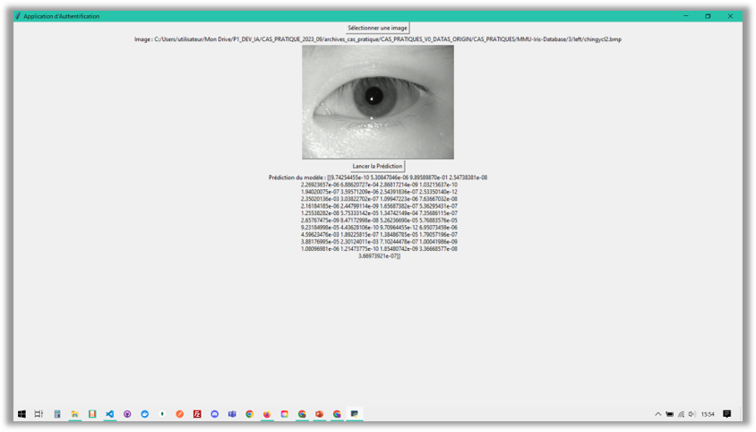
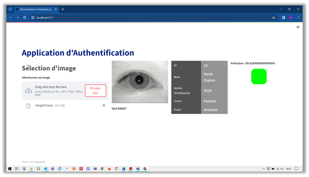

# CERTIF_CAS_PRATIQUE


# Cas Pratique : IA pour la reconnaissance d’iris
## Vous êtes un développeur IA, votre entreprise vous a confié la mission de développer une interface de reconnaissance d’oeil pour une entreprise souhaitant authentifier ses 45 employés à partir d’un scan de leurs yeux. Un employé avait déjà travaillé sur ce projet et vous livre la base de données, ainsi que son notebook qui avait permis la préparation de sa base de données et l’entrainement d’un modèle à l’authentification d’un employé à partir de l’image d’oeil gauche. Aussi, cet employé avait récupéré le modèle entrainé dans une application de prédiction qu’il avait développé en tkinter. Cependant, des problèmes subsistent : le modèle n'atteint pas les performances optimales, l'interface utilisateur manque d'ergonomie et se limite uniquement à la prédiction à partir des images d'yeux gauches. En outre, les prédictions actuelles fournissent les probabilités d'appartenance à chaque employé plutôt que l’identifiant respectif et les informations personnelles.  

# Eléments fournis
1. Jeu de Données :
- Le jeu de données comprend 45 sous-dossiers, chacun correspondant à l'identifiant d'un employé (de 1 à 46, excluant 4).
- Chaque sous-dossier contient des images d'oeil gauche et droit, réparties dans les répertoires "left" et "right".
2. Un fichier JSON stockant les informations de chaque employé (pour chaque ID, il fournait : nom, date_embauche, genre, poste).
3. Notebook d'Entraînement : Le notebook fournit les étapes détaillées de la préparation des données et de l'entraînement du modèle pour la reconnaissance d'oeil gauche.
4. Application d'Authentification d'OEil gauche  

# Cahier de charge
1. Améliorer le programme d’IA existant pour permettre la bonne classification d’un employé à partir d’un scan d’un de ses yeux (oeil droit ou oeil gauche, besoin d’un classifieur pour chaque).
2. Développer une application conviviale qui réalise les tâches suivantes :
- Permettre le téléchargement d'une image de l'oeil d'un employé.
- Afficher l'image téléchargée.
- Prédire si l'oeil est gauche ou droit.
- Authentifier l'employé en utilisant le classifieur approprié en fonction de la prédiction précédente et en affichant les informations de la personne authentifiée.

# Livrable attendu
- Un rapport écrit des réalisations produites, de 5 à 10 pages.
- Une synthèse orale du travail à prévoir, de 5 minutes (support ppt, vidéo démo).

# Compétence(s) visée(s)
- C8. Modifier les paramètres et composants de l’intelligence artificielle afin d’ajuster aux objectifs du projet les capacités fonctionnelles de l’algorithme à l’aide de techniques d’optimisation
- C14. Améliorer l’application d’intelligence artificielle en développant une évolution fonctionnelle pour répondre à un besoin exprimé par un client ou un utilisateur

---
---
# Notebooks pour modèles disponibles
---
---

# Utilisation de l'application:
1. Créer l'environnement virtuel.
2. ```pip install requirements.txt```
4. Lancer l'application streamlit :
- Répertoire /app
- Executer ```streamlit run app.py```
- Enjoy ;p

